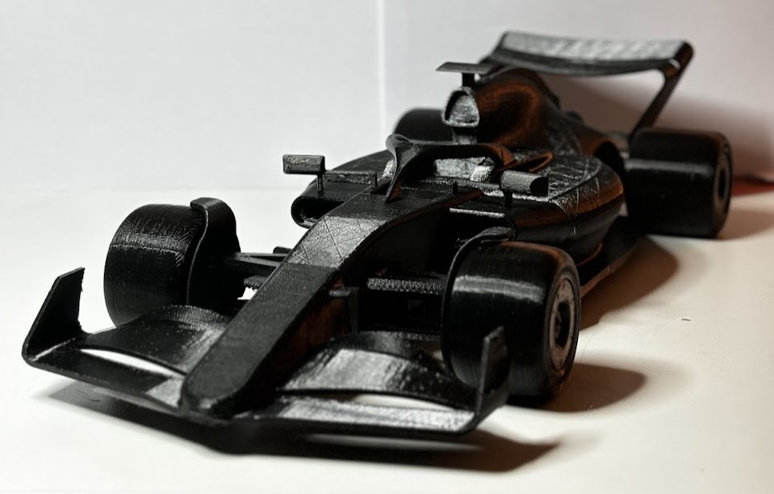

# RC Drive Controller

Simple ESP32 based controller for basically any RC car (this one is used with the [OpenRC](https://www.printables.com/model/2714-openrc-f1-car-110-rc-car))

- It receives input data through iBUS (from radio controllers)
- Has an OLED I2C output to show the user in what mode the controller is in
- Has a telemetry BLE stream
- Supports drift and traction control (haven't tested TC as I couldn't get hall sensor onto wheels on this iteration of OpenRC)

